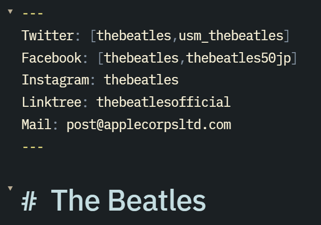
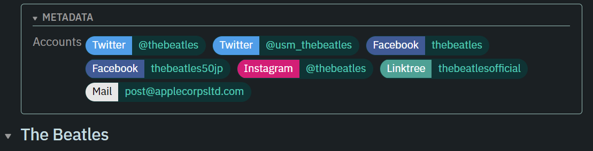
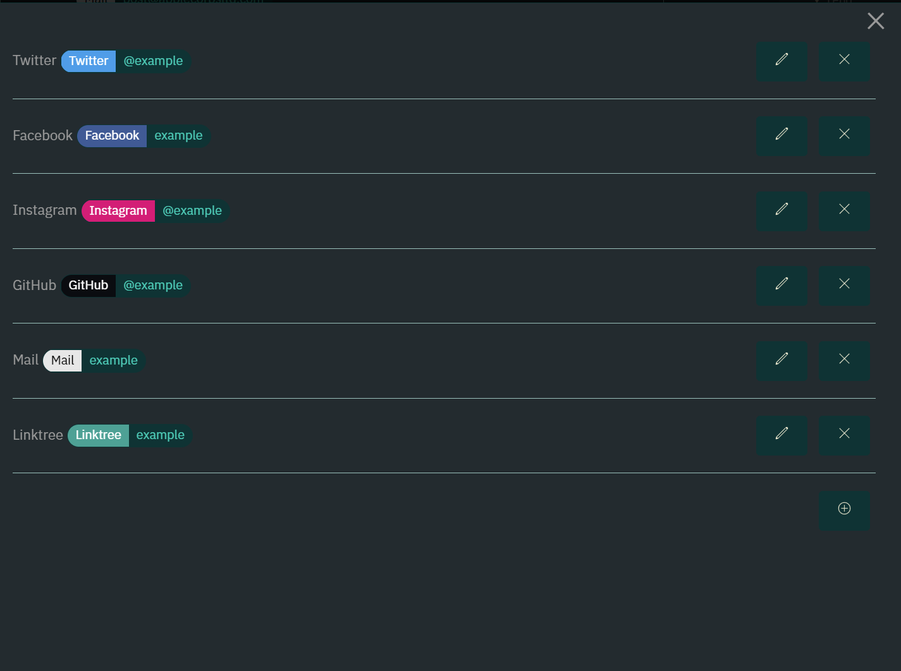

# Obsidian Account Linker
This is an Obsidian plugin for systematically listing accounts to external sites in the front matter
## Example
- Input:

- Preview:

- Settings:

## Features
- Generate a link button for the configured service based on the description of the frontmatter
- The following settings are available
  - Name of the service
  - Base color of the service
  - URI substitution rules (currently only supports `{{NAME}}`)
  - Account name substitution rules (currently only `{{NAME}}` is supported)
-  More advanced configuration by using URI schemes such as `mailto://` or `obsidian://`

## TODO
- Reverse generation of account names from URIs
- Set favicons on links
## LICENSE
MIT